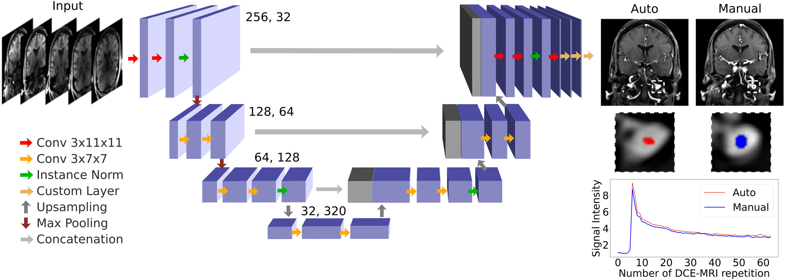

## Automatic detection of arterial input function for brain DCE-MRI in multi-site cohorts

This is the Keras/TensorFlow implementation for automatic detection of the arterial input function in brain DCE-MRI. Pretrained model weights are provided and linked below.

Article to Cite:

Saca, L., et al. [Automatic detection of arterial input function for brain DCE-MRI in multi-site cohorts](https://onlinelibrary.wiley.com/doi/10.1002/mrm.70020). *Magnetic Resonance in Medicine*, 94(6), 2732–2744 (2025). PMID: 40808286



### Requirements

 - TensorFlow 2.12+
 - Keras 2.12+
 - Python 3.9+
 - Numpy
 - Scipy
 - Pandas

### Installation
Clone the repository. 
```bash
git clone https://github.com/petmri/vascular_function.git
cd vascular_function
```

To install the dependencies, either `conda` and `venv` are recommended for managing Python environments.
To use `venv`:
```bash
sudo apt install python3.10-venv
python3 -m venv tf
source tf/bin/activate
pip install -r requirements.txt
```

### Preparing the data

Input data should be in gzipped NIfTI format (`.nii.gz`) in radiological orientation. The training/testing data used spans a range of dimensions, from 208×256×40×50 to 320×320×14×64. Images are automatically resampled so input image dimensions should not matter unless they are very far from this size, in which case manual resampling is recommended.

At runtime, the pipeline performs the following steps:
1. The image and mask are normalized using min–max normalization.
2. Both are resampled to 256×256×32×32.
3. The data is converted to TFRecords for efficient loading within the TensorFlow pipeline.

### Inference

Download the pretrained weights [here](https://github.com/petmri/vascular_function/releases/download/v2.0.0/model_weight_huber1.h5), then run:

    python main_vif.py --mode inference --input_path /path/to/data/input_data.nii.gz \
    --model_weight_path /path/to/model_weight/weight.h5  \
    --save_output_path /path/to/folder/output/ \
    --save_image 1

The model predicts a vascular function curve and a 3D mask. The output is automatically resampled back to the original image dimensions, and the predicted mask is applied to extract the vascular function. Figures showing the predicted ROI and the resulting VF curve are also saved.

The pretrained model was trained using only the Huber temporal loss. Although a spatial loss term was available, we found that temporal loss alone produced the best results.

### Training
To train a new model, organize your dataset by site as shown below:
```
dataset
├── site1
│   ├──images
│        └── id_x.nii.gz
│   ├── masks
│        └── id_x.nii.gz
├── site2
│   ├──images
│        └── id_x.nii.gz
│   ├── masks
│        └── id_x.nii.gz
├── site3
│   ├──images
│        └── id_x.nii.gz
│   ├── masks
│        └── id_x.nii.gz
```
**Note:** All NIfTI files must be 32-bit.

By default, the data is split 80/10/10 (train/validation/test) per site. The generated splits are saved as text files in the checkpoint directory; if they already exist, they will be reused. Similarly, TFRecords are only written if they are not already present. The random seed is fixed for reproducibility.

To train the model, run:

    python main_vif.py --mode training --dataset_path /path/to/dataset/ \
    --save_checkpoint_path  /path/to/save/save_weight/

To see all available options, run:
```bash
python main_vif.py -h
```
